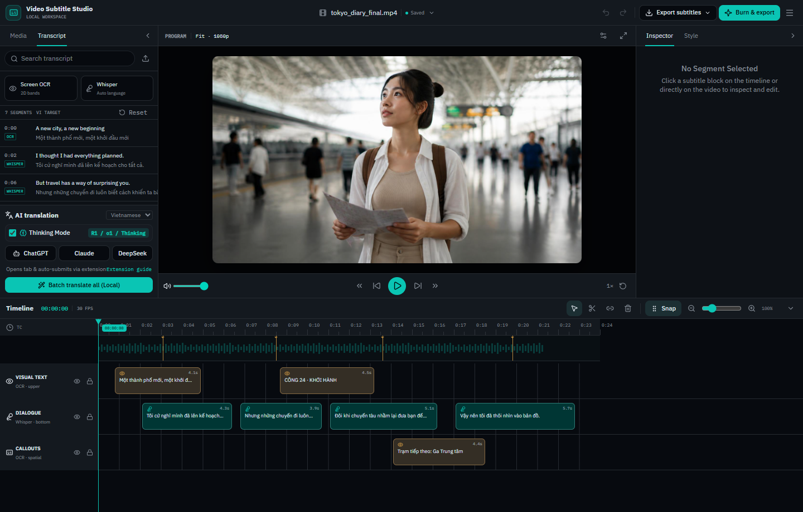

# Video Subtitle Studio 🎬

[](LICENSE)
[](https://github.com/Loc1ran/video-subtitle-overlay/actions/workflows/ci.yml)
[](https://m8ven.ai/mcp/loc1ran-video-subtitle-overlay-rqxd0m)
[](https://www.python.org/)
[](https://fastapi.tiangolo.com/)
[](https://react.dev/)



An all-in-one local desktop workspace for extracting, translating, editing, masking, and burning subtitles onto videos.

Designed for content creators, localizers, and video editors who need to translate foreign videos, replace or mask hardcoded subtitles, and export production-ready subtitled videos without relying on costly cloud APIs.

---

## ✨ Features

- **🎙️ Speech-to-Text Transcription**: Powered by OpenAI Whisper (`tiny`, `base`, `small`) with automatic speech detection and timestamp alignment.
- **👁️ Video Screen OCR**: Automatic on-screen subtitle detection and text extraction via EasyOCR for hardcoded/burned-in video text.
- **🎨 Auto Color & Style Detection**: Analyzes video frames to detect existing subtitle background, outline, and text colors.
- **🎛️ Interactive Timeline Workspace**:
  - Multi-track timeline with zoom, playhead scrubbing, split (S), merge (M), and delete controls.
  - Direct on-video drag-and-drop subtitle repositioning with smart anchors (`\an4`, `\an5`, `\an6`).
  - Real-time visual style preview (font size, letter spacing, corner radius, padding, opacity).
- **🛡️ Clean Subtitle Masking**:
  - **Fitted Capsule / Rounded Box**: Masks underlying original subtitles with exact corner radii (Square, Subtle, Rounded, Pill).
  - **Full-Width Bar**: Horizontal banner spanning the video.
  - **Text Outline**: Clean floating text with drop-shadow and stroke.
- **🌐 AI Translation Bridge (No API Keys Required)**:
  - Included Chrome/Edge extension bridges Video Subtitle Studio directly with **ChatGPT**, **DeepSeek**, **Claude**, and **Gemini**.
  - Automatically types translation prompts with context rules, waits for streaming output, and syncs translations straight back to the editor.
  - Built-in machine translation fallback via `deep-translator`.
- **🪞 Horizontal Video Mirroring (Flip Video)**:
  - Mirror or flip videos horizontally with a single click while automatically keeping transcript OCR boxes, subtitle coordinates, and readable translations intact.
  - Seamlessly supported during timeline playback preview, ASS generation, and FFmpeg export across standard and reframed modes.
- **📱 Smart Video Auto-Reframe**:
  - Convert videos between TikTok / Shorts / Reels (9:16), YouTube (16:9), and native aspect ratios.
  - Choose between Blurred Background duplicate, Center Crop to Fill, and Letterboxed Black Bars with TikTok UI safe-zone guides.
- **🔥 Dual-Layer ASS Vector Subtitle Burning**:
  - Precision vector subtitle rendering using FFmpeg and Advanced SubStation Alpha (`.ass`).
  - Exports burned `.mp4` video, `.srt` standard subtitle file, and `.ass` styled subtitle file.
- **🔌 Model Context Protocol (MCP) Server**:
  - Integrates with AI assistants (Claude Desktop, Cursor) through FastMCP tools (`list_videos`, `get_transcript`, `update_subtitles`, `render_subtitled_video`).

---

## 🚀 Quick Start

### Prerequisites
1. **Python 3.10+**
2. **FFmpeg** installed and accessible in your system `PATH` (Run `ffmpeg -version` to verify).
3. *(Optional)* **Bun** or **Node.js** if you wish to modify and rebuild the frontend.

### Installation

1. **Clone the repository**:
   ```bash
   git clone https://github.com/Loc1ran/video-subtitle-overlay.git
   cd video-subtitle-overlay
   ```

2. **Install Python dependencies**:
   ```bash
   python -m venv venv
   # On Windows:
   venv\Scripts\activate
   # On Linux/macOS:
   source venv/bin/activate

   pip install -r requirements.txt
   ```

### Launching the Application

- **Windows (1-Click)**:
  Double-click `start.bat`.

- **Cross-Platform (Terminal)**:
  ```bash
  python run_app.py
  ```

Your browser will automatically open to `http://localhost:8000`.

---

## 🧩 Browser AI Bridge Extension Setup

To use automated browser translation with ChatGPT, Claude, DeepSeek, or Gemini without paying for API tokens:

1. Open **Chrome** or **Edge** and go to `chrome://extensions` (or `edge://extensions`).
2. Toggle on **Developer mode** in the top right.
3. Click **Load unpacked** in the top left.
4. Select the `subtitle-ai-extension` directory inside this repository.
5. In Video Subtitle Studio, extract or load subtitles, open your AI chat tab, click the extension icon, and click **Start Auto-Translation**.

---

## 📁 Repository Structure

```
video-subtitle-studio/
├── app/
│   ├── main.py             # FastAPI backend server & REST API
│   ├── transcriber.py      # Whisper speech recognition engine
│   ├── video_ocr.py        # EasyOCR screen text detector & color extractor
│   ├── translator.py       # Batch translator engine
│   ├── video_processor.py  # FFmpeg dual-layer ASS subtitle burning engine
│   └── static/             # Built production frontend assets
├── frontend/
│   ├── src/
│   │   ├── components/     # Video Subtitle Studio React components & timeline
│   │   ├── routes/         # TanStack file-based routing
│   │   └── lib/            # Utilities and prompt templates
│   ├── package.json
│   └── vite.config.ts
├── subtitle-ai-extension/  # Chrome/Edge AI translation bridge extension
├── tests/                  # Pytest unit tests (API & video processor)
├── mcp_server.py           # Model Context Protocol (MCP) server
├── requirements.txt        # Python package dependencies
├── requirements-dev.txt    # Development and testing dependencies
├── run_app.py              # Application launcher & port manager
├── start.bat               # Windows one-click launcher
├── stop.bat                # Windows server stop script
├── build_frontend.bat      # Frontend build script
└── LICENSE                 # MIT License
```

---

## 🧪 Running Tests

To run the automated backend test suite locally:

```bash
pip install -r requirements-dev.txt
pytest tests/ -v
```

To run frontend linting and build checks:

```bash
cd frontend
bun run lint
bun run build
```

---

## 🤝 Contributing

Contributions, issues, and feature requests are welcome!
Feel free to open an issue or submit a pull request.

---

## 📄 License

This project is open-source and licensed under the [MIT License](LICENSE).
